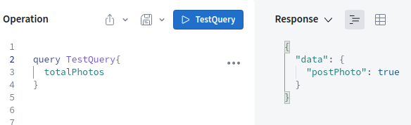
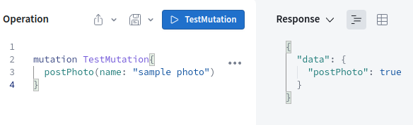
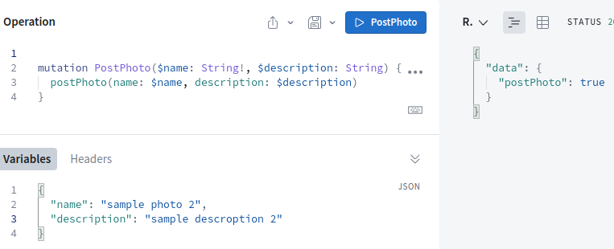
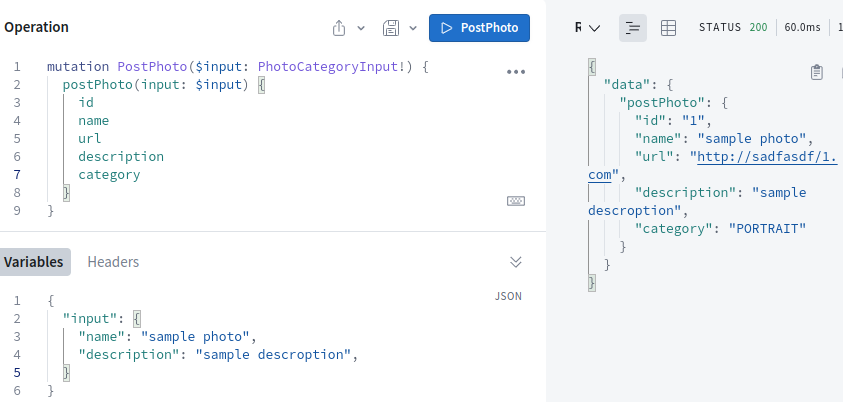

## Описание проекта

Тренировочный проект по graphql, АПИ часть

В данном проекте имеются фалйлы index_exam_*, которые необходимо смотреть по порядку, в них содержиться полноценные АПИ структуры с поышением сложности.\
В зависимости от того какую структцры вы хотите протестировать, переименуйте нужный вам файл в "index.js" и запустите проект.

**Использование библиотек**
~~~shell
(1-4 файлы)
"apollo-server" - для установки экземпляра Apollo-Server
"graphql" - для получения доступа к спецификации graphql
"nodemon" - автоматический перезапуск проекта при внесении изменений

(5-10 файлы)
"express" - для более комфортной разработки АПИ на Node
"apollo-server-express" - для установки экземпляра Apollo-Server в окружении express
"graphql" - для получения доступа к спецификации graphql
"nodemon" - автоматический перезапуск проекта при внесении изменений
~~~

**Скрипты**\
После флага е указываем какие файлы нам надо прослушивать на предмет изменений. По умолчанию будет главным тот файл который указан в "main"
~~~shell
"start": "nodemon -e js,json,graphql"
~~~

## Передача данных
Названия Запросов и Мутаций могут быть любыми, однако внутри необходимо указывать имена схемы\распознаателя\
**Query(из первого файла)**\
\
**Mutation(из первого файла)**\
\
(с переменными)(из первого файла)\
\
(с переменными обусловлеными конкретной схемой типов)(из второго файла)\
\
.

